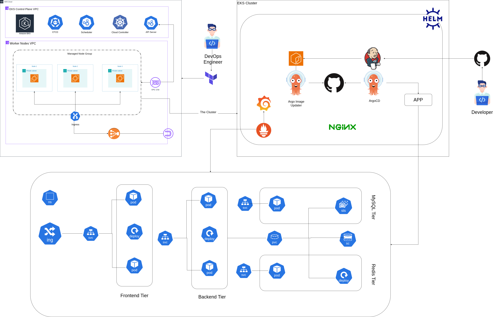

# Terraform AWS EKS Managed

This project provides Terraform configurations to set up and manage an AWS EKS (Elastic Kubernetes Service) cluster. The EKS cluster serves as the foundation for deploying containerized applications, enabling scalability, high availability, and integration with AWS services. Additionally, a Jenkins pipeline is configured to build and push Docker images using Kaniko, and ArgoCD is used for GitOps-based application deployment.

## Project Structure

- **Terraform Configurations**: Includes modules and resources to provision the EKS cluster, node groups, and associated AWS infrastructure.
- **chart/my-app**: Contains Helm chart for deploying applications on the EKS cluster.

### Key Components
- **EKS Cluster**
- **Node Groups**: EC2 instances configured as worker nodes.
- **IAM Roles**: Roles and policies for EKS, worker nodes, and Kubernetes services.
- **AWS Secrets Manager**: storing and managing secrets.
- **External Secrets Operator (ESO)**: synchronizes secrets from external providers.


### Jenkinsfile
Continuous Integration (CI). **Kaniko** build Docker images within a continuous integration (CI) pipeline.

### ArgoCD
continuous deployment (CD).

### ArgoCD Image Updater
integrates with ArgoCD to streamline the process of keeping applications up-to-date.


## Deployment Steps

### Prerequisites

- **Terraform**: Installed and configured.
- **AWS CLI**: Installed and authenticated.
- **kubectl**: Installed for Kubernetes management.

### Terraform Deployment

1. **Provide Variable Values**:
   Create a `terraform.tfvars` file 

2. **Initialize Terraform**:
   ```bash
   terraform init
   ```

3. **Plan the Infrastructure**:
   ```bash
   terraform plan
   ```

4. **Apply the Configuration**:
   ```bash
   terraform apply
   ```

5. **Access the Cluster**:
   Configure `kubectl` to connect to the EKS cluster:
   ```bash
   aws eks --region <region> update-kubeconfig --name <cluster-name>
   ```

6. **Deploy Applications**:
   Use Helm or `kubectl` to deploy applications to the cluster.


### Helm Deployment
- Update the `values.yaml` file with your configuration 

### CI/CD Pipeline
- Configure Jenkins with the provided `Jenkinsfile`.
- Trigger the pipeline to build and push Docker images.

### ArgoCD Deployment  
- Synchronize the application.


### Monitoring
- Access Prometheus and Grafana using the configured ingress URLs

## Notes

- Customize the node group instance types and scaling parameters as needed.
- Use the `chart/my-app/values.yaml` file for deploying sample applications if required.
- Sensitive values like AWS credentials should not be hardcoded and must be securely managed.
